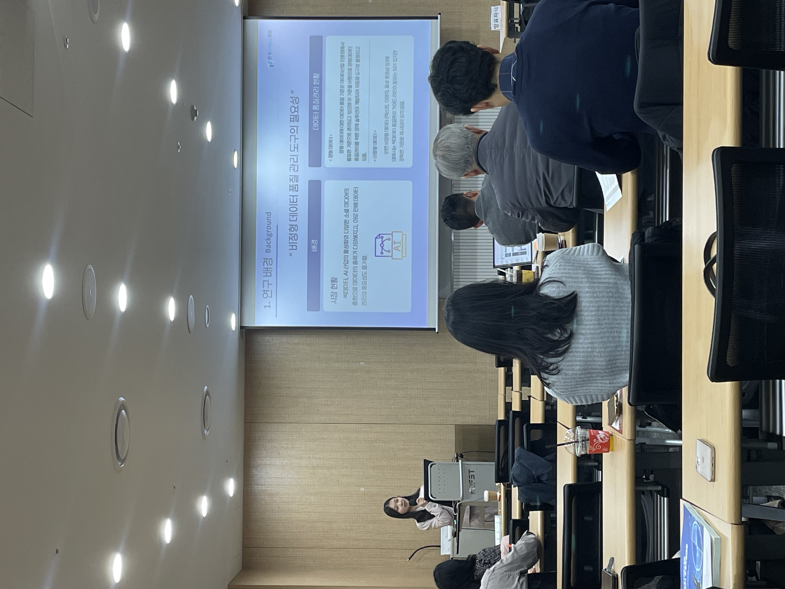
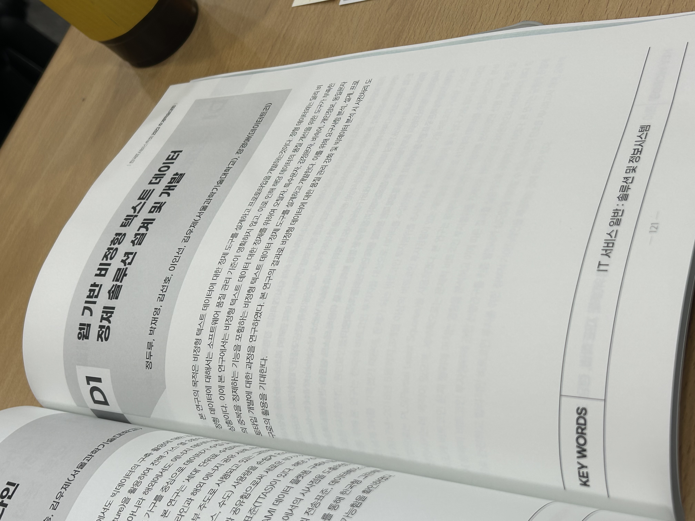

# CapstoneProject-Afterwards
A repository dedicated to documenting and preserving the achievements of my capstone project - Senior at Seoultech, ITM

:tada: Finally,
web service has been fully transferred to DATATREE _- strategic data solutions corp_, as the service named **DT-Clean**.  
- Details - [DT Clean from Datatree](http://datatree.kr/product/)

  
Please reach out customer inquires (http://datatree.kr/cs/cs04.php) to find more details :smiley:
  
## :trophy: Achievements

- _[Nov. 15, 2023]_ Participated on 2023 Fall Conference of the Korean IT Service Association

| Presentation | Paper |
|---|---|
|  |  |

  
- _[Dec. 1, 2023]_ Awarded Grand Prize in 2023 Capstone Design Conference hosted by the ITM major by implementing and presenting web-based unstructured big data preprocessing service  

 

:point_down::point_down: Official Presentation by [Authors](#authors)

## :dart: Project Overview

### Research Topic
Development of a web-based solution for refining unstructured data derived from individual knowledge activities, focusing on social media, e-commerce reviews, and forum posts.
  
### Research Objectives
The primary goal is to create a robust web service solution for enhancing the quality of textual data generated by individuals. The solution is specialized in refining content from various sources, including social networking sites, online shopping platforms, and community forums.

## :computer: Project Details
  
### Key Functions
**1. Error Detection**  
    After uploading input file(.txt/ .jpg), user can get the information of detected errors.
> Supported error types are followings:  
    sentence duplication, personal data, slang, special character, typo

**2. Error Conversion**  
    By selecting detected errors to be converted, user can get clean data effectively. 
> Suported options are followings:  
    automatic conversion, manual conversion

**3. Result Visaulization**  
    To ensure function quality, and effective visualization, detection/conversion report are provided.
    Statistics function shows overall result within each modules.

  
### Development Environment

**System Architecture**  

**Front-end**  

**Backend**  

**Database**  

## :bowtie: Authors
- [Dooroo Jeong](https://github.com/doorooful)
- [Jaeyoung Park](https://github.com/yoouung)

